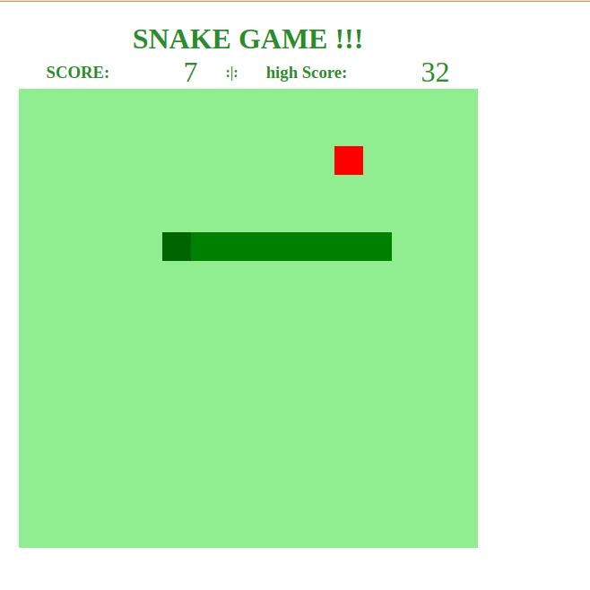
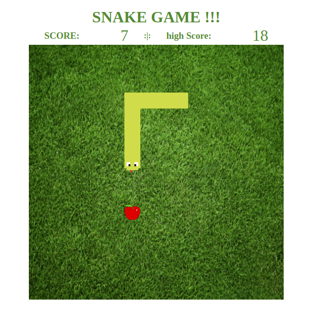

  

# Snake (A.K.A. jogo da cobrinha) :snake:

## Objetivo:
Reproduzir o famoso jogo da cobrinha (Snake)

## Conceitos aprendidos:
- Criação de página HTML.
- Utilização de classes e ID para identificação.
- Utilização da api HTML canvas.
- Manipulação de eventos gerados pelo teclado.
- inserção de imagens utilizadas no canvas. (adicionado por mim)
- Persistência por meio do uso do localstorage. (adicionado por mim)

## URL:
 [https://marlonveiga-santos.github.io/snake-dio/](https://marlonveiga-santos.github.io/snake-dio/)
 
## Fonte do treinamento:

[Bootcamp - HTML Web Developer](https://web.digitalinnovation.one/track/html-web-developer?tab=path)

## Demo:

